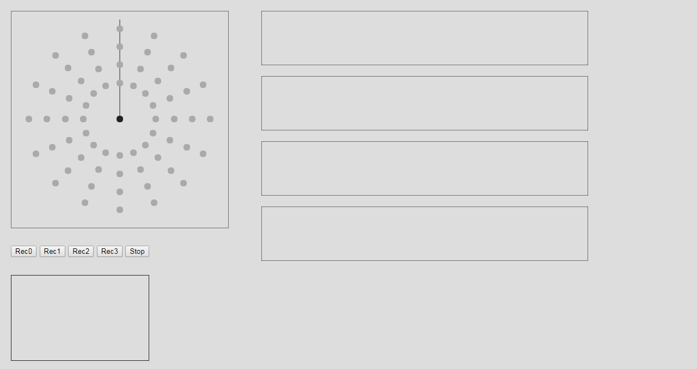
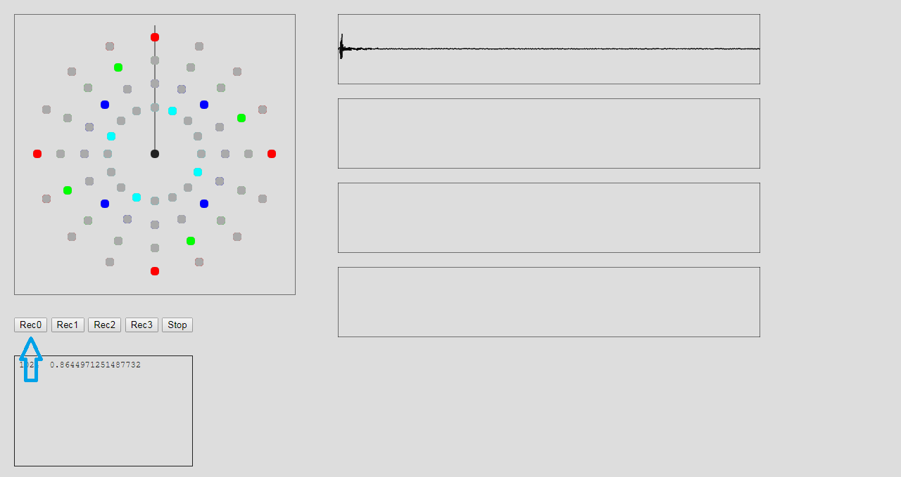
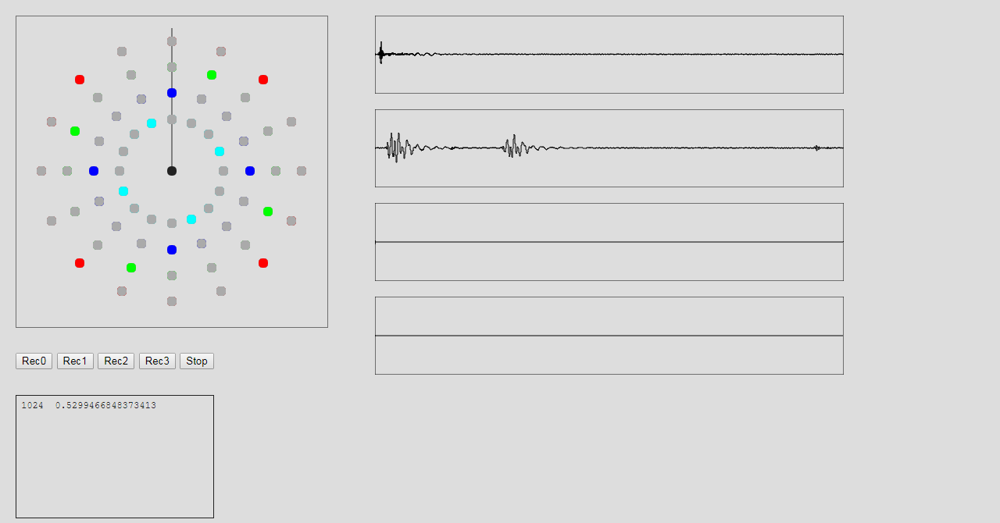
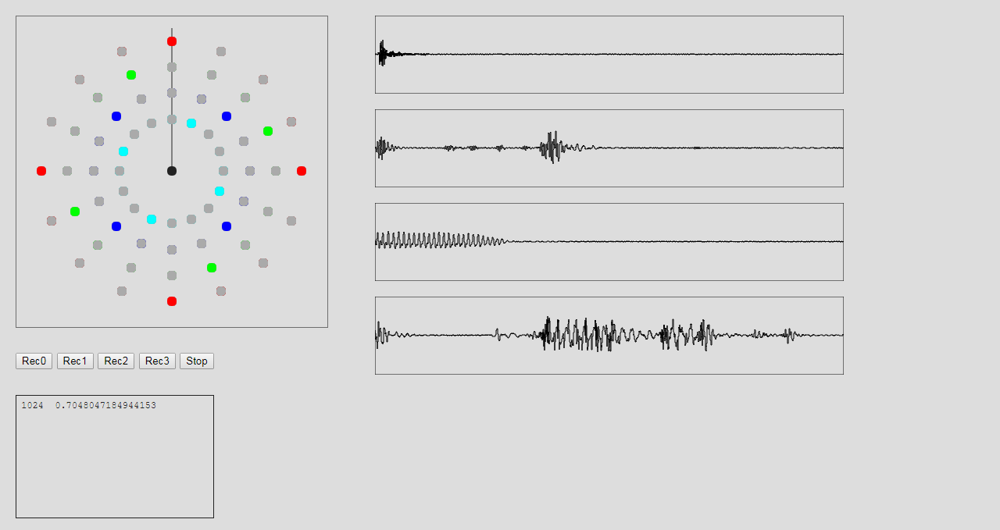

# Pop-Looper

- These programs is for playing sounds you record using your PC microphone

- You can play to accsess as below. 
https://mikatahara.github.io/Pop-Looper/

 

 

- push the REC0 button to record sound on first track.
- Clap your hand
- The sound is recorded and display right on top window.
- and the sound is repeatly played.

 

 

- push the REC1 button to record sound on second track.

 

 

- push the REC2 button to record sound on 3rd track.
- push the REC3 button to record sound on 4th track.

 

 
